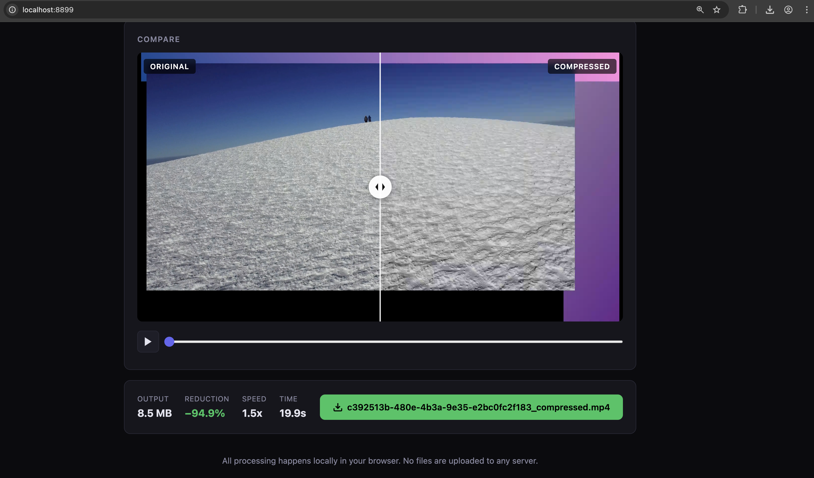

# VidCompress



Local, hardware-accelerated video compression that runs entirely in your browser. No FFmpeg install, no cloud uploads — just a single command.

```
uvx vidcompress
```

## How it works

VidCompress launches a tiny local web server and opens a browser tab. All video encoding/decoding happens **client-side** using the [WebCodecs API](https://developer.mozilla.org/en-US/docs/Web/API/WebCodecs_API), which talks directly to your GPU's hardware encoder (VideoToolbox on Mac, NVENC on NVIDIA, AMF on AMD).

```
┌──────────────────────────────────────────────────────────┐
│  Browser (Chrome/Edge)                                   │
│                                                          │
│  MP4Box.js     VideoDecoder     VideoEncoder   mp4-muxer │
│  (demux)   →   (HW decode)  →  (HW encode) →  (remux)   │
│                                                          │
│  ↕ GPU: VideoToolbox / NVENC / AMF / VA-API              │
└──────────────────────────────────────────────────────────┘
│  Python server (FastAPI) — only serves static files      │
└──────────────────────────────────────────────────────────┘
```

Your files never leave your machine.

## Quick start

### With uv (recommended)

```bash
# Run directly — no install needed
uvx vidcompress

# Or install globally
uv tool install vidcompress
vidcompress
```

### With pip

```bash
pip install vidcompress
vidcompress
```

### From source

```bash
git clone https://github.com/arpantripathi/ffmpeg-compression-local.git
cd ffmpeg-compression-local
uv run vidcompress
```

## Features

- **Hardware-accelerated** — uses your GPU encoder, not software encoding
- **Zero dependencies** — no FFmpeg, no native libraries to install
- **Fully local** — nothing leaves your machine
- **Codec choice** — H.264, H.265 (HEVC), VP9, AV1
- **Resolution scaling** — downscale to 1080p, 720p, 480p, 360p
- **Quality control** — adjustable quality slider with exponential bitrate mapping
- **Audio re-encoding** — automatic AAC/Opus transcoding
- **Drag & drop** — simple, clean UI

## Supported codecs

| Codec | Container | Mac (Apple Silicon) | Windows (NVIDIA) | Windows (AMD) |
|-------|-----------|-------------------|-----------------|---------------|
| H.264 (AVC) | MP4 | VideoToolbox | NVENC | AMF |
| H.265 (HEVC) | MP4 | VideoToolbox | NVENC | AMF |
| VP9 | WebM | Software* | Software* | Software* |
| AV1 | MP4 | VideoToolbox (M3+) | NVENC (RTX 40+) | AMF (RX 7000+) |

*VP9 encoding may fall back to software on some platforms. Hardware support depends on your browser and GPU drivers.

## Performance

Typical encoding speeds for 1080p video (hardware-accelerated):

| Codec | Apple M1/M2 | NVIDIA RTX 3060+ | AMD RX 6000+ |
|-------|------------|-------------------|--------------|
| H.264 | 200-400 fps | 300-500 fps | 200-350 fps |
| H.265 | 150-300 fps | 200-400 fps | 150-250 fps |
| AV1 | 60-120 fps (M2+) | 100-200 fps (RTX 40+) | 80-150 fps |

A 10-minute 1080p video typically compresses in **30-90 seconds**.

## Browser requirements

- **Chrome 94+** or **Edge 94+** (full WebCodecs support)
- Firefox: partial support (video encoding may not work)
- Safari: partial support (limited codec options)

## CLI options

```
vidcompress [OPTIONS]

Options:
  -p, --port PORT    Port to serve on (default: 8899)
  --host HOST        Host to bind to (default: 127.0.0.1)
  --no-open          Don't open browser automatically
  --version          Show version and exit
  -h, --help         Show help
```

## Publishing to PyPI (for maintainers)

This section covers how to publish `vidcompress` so anyone can run `uvx vidcompress`.

### 1. Prerequisites

```bash
# Create a PyPI account at https://pypi.org/account/register/
# Then create an API token at https://pypi.org/manage/account/token/
# (scope it to the "vidcompress" project after first upload)
```

### 2. Check the package name

Before publishing, verify that `vidcompress` is available on PyPI. If it's taken, update the `name` field in `pyproject.toml`.

### 3. Build

```bash
uv build
```

This creates `dist/vidcompress-0.1.0.tar.gz` and `dist/vidcompress-0.1.0-py3-none-any.whl`.

### 4. Test on TestPyPI first (recommended)

```bash
# Upload to TestPyPI
uv publish --publish-url https://test.pypi.org/legacy/ --token pypi-YOUR_TEST_TOKEN

# Try installing from TestPyPI
uv tool install --index-url https://test.pypi.org/simple/ vidcompress
```

### 5. Publish to PyPI

```bash
uv publish --token pypi-YOUR_TOKEN
```

Or set the token as an environment variable:

```bash
export UV_PUBLISH_TOKEN=pypi-YOUR_TOKEN
uv publish
```

### 6. Verify

```bash
# Anyone can now run:
uvx vidcompress
```

### Subsequent releases

1. Bump the version in both `pyproject.toml` and `src/vidcompress/__init__.py`
2. `uv build`
3. `uv publish --token pypi-YOUR_TOKEN`

## Development

```bash
git clone https://github.com/arpantripathi/ffmpeg-compression-local.git
cd ffmpeg-compression-local

# Run in development
uv run vidcompress

# Or with live reload (edit static files, refresh browser)
uv run vidcompress --port 3000
```

The Python server is minimal — it only serves static files. All encoding logic is in `src/vidcompress/static/app.js`.

## Architecture

```
src/vidcompress/
├── __init__.py        # Version
├── __main__.py        # python -m vidcompress
├── cli.py             # CLI argument parsing + server launch
├── server.py          # FastAPI static file server (10 lines)
└── static/
    ├── index.html     # UI structure
    ├── style.css      # Dark theme
    └── app.js         # WebCodecs transcoding pipeline
```

### Frontend pipeline (app.js)

1. **Demux** — mp4box.js reads the input MP4/MOV and extracts raw encoded samples
2. **Decode** — `VideoDecoder` (hardware) decodes samples into raw `VideoFrame`s
3. **Resize** — `OffscreenCanvas` scales frames if resolution change is requested
4. **Encode** — `VideoEncoder` (hardware) re-encodes frames with the chosen codec/bitrate
5. **Mux** — mp4-muxer or webm-muxer packages encoded chunks into the output container
6. **Download** — output is offered as a browser download

## Limitations

- **Input formats**: MP4 and MOV files only (mp4box.js limitation). WebM input is not supported yet.
- **File size**: Limited by browser memory. Files over ~2 GB may cause issues.
- **Codec availability**: Depends on your browser, OS, and GPU. H.265 and AV1 encoding may not be available on all systems.
- **No B-frame control**: WebCodecs doesn't expose fine-grained encoding parameters like CRF or B-frame count.
- **Audio**: Audio re-encoding may fail for some input formats. The video will still be compressed.

## License

MIT
